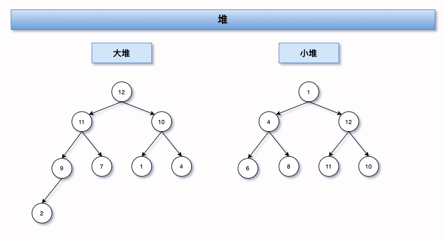
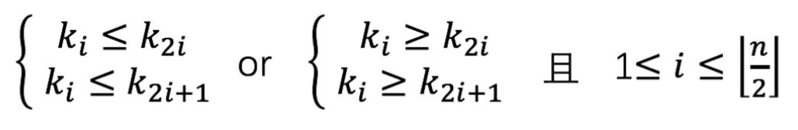

### 什么是堆？
```text
堆是一棵完全二叉树，分为两种大根堆和小根堆
```

1. 完全二叉树

   每个父子节点只有两个子节点，且所有节点都保持向左对齐


2. 大小堆

   大堆：每个节点的值都大于或者等于左右子节点的值

   小堆：每个节点的值都小于或者等于左右子节点的值



##### 堆总结：如果堆的根节点从1开始进行编号（从上到下，左到右边顺序进行编号），则满足一下关系



即由上图中的大小堆可转换成列表：

```python
# 大堆
big_head_list = [12, 11, 10, 9, 7, 1, 4, 2]
# 小堆
min_head_list = [1, 4, 12, 6, 8, 11, 10]
```


### 堆应用

##### 优先级队列

​	合并 n 个有序小文件 把 n 个有序的小文件的第一个元素取出，放入堆中，取出堆顶到大文件，然后再从小文件中取出一个加入到堆，这样就把小文件的元素合并到大文件中了


#####海量关键词搜索记录，求搜索次数 topK

​	a. 先用 hashTable 去重，并累加搜索次数
​	b. 再建立大小为 K 的小顶堆，遍历散列表，次数大于堆顶的，顶替堆顶入堆（就是应用 2 的解法）

​	散列表很大时，超出内存要求
​		建立 n 个空文件，对搜索关键词求哈希值，哈希值对 n 取模，得到该关键词被分到的文件号（0 到 n-1）对每个文件，利用散列和堆，分别求出 topK，然后把 n 个 topK（比如 10 个 Top 20，200 很小了吧）放在一起，出现次数最多的 K（20）个关键词就是这海量数据里搜索最频繁的


#####用堆求 Top K（就是从一堆数据中找出前 k 大的数据） 

​	a. 针对静态数据（数据不变） 建立大小为 K 的小顶堆，遍历数组，数组元素与堆顶比较，比堆顶大，就把堆顶删除，并插入该元素到堆 

​	b. 针对动态数据（数据不断插入更新的） 在动态数据插入的时候就与堆顶比较，看是否入堆，始终维护这个堆，需要的时候直接返回，最坏 O (n*lngK)


